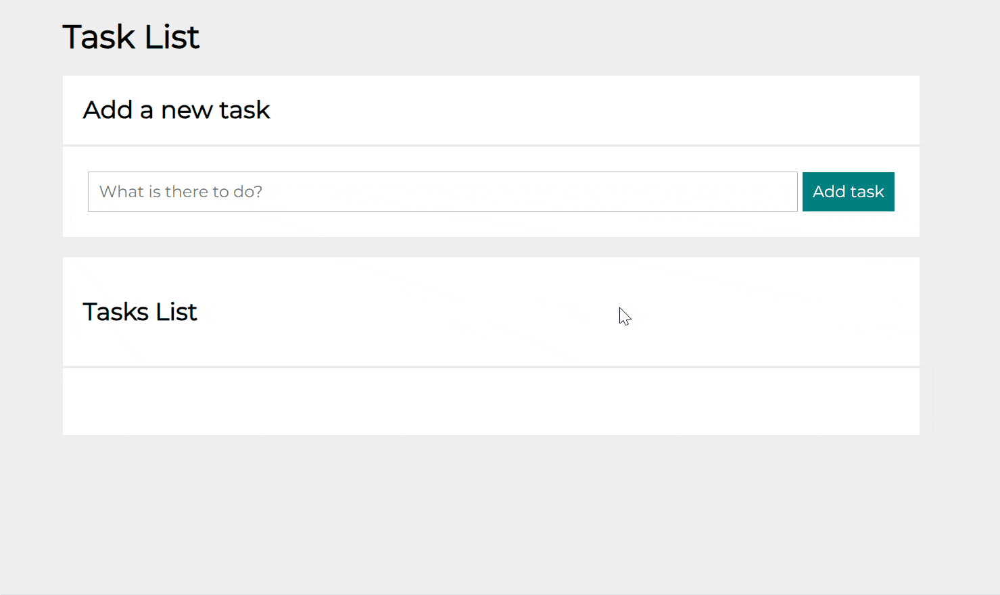

# ToDo-List

## It is a simple application that was created for daily use to help organize and prioritize tasks to be done.

You can also see a short video showing how the app works on GIF

You can also test it yourself, it is very easy to use:
- in the window "What is there to do?" (marked with a box) we type the task we want to add to our list,
- then press the "Add task" button (green button),
- the task will jump to the list below marked "Task List"
- to deselect the task, press the small green square (button) next to the name of your task,
- if you decide that you no longer need the task on the list, you can also delete it using the red square with the trash can icon (button).

### You can also test the application yourself.

Link below:

https://tomaszbrylski.github.io/ToDo-List/

### Languages / Technologies
- HTML
- Java Script
- CSS
- BEM
- GRID
- ScreenToGit
- MidJourney 
